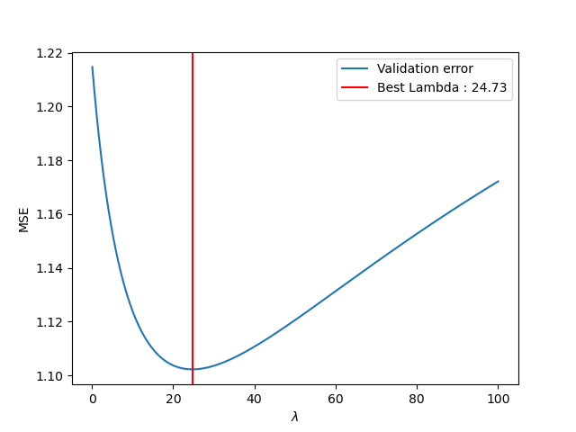

# Assignment 1 - Linear Regression

Your environment will additionally need the package `pandas` over the one in assignment 0. There are two ways to do this:
1. You can reuse your environment from assignment 0 by activating it and then writing `conda activate ml4phys` and then `conda install pandas`.
2. Delete the environment with `conda env remove -n ml4phys` (while the environment is deactivated!) and then reinstalling it via `conda env create -n ml4phys --file environment.yml`. 

At the bottom of this file you will find a reminder on how to run the python scripts.

## Grade
- Autograded: [](../../actions) 
- Exercise 4: __/10 points (manual)
- Exercise 5: __/10 points (manual)
- Exercise 6: __/6 points (manual) + (4P auto)
- Exercise 7: __/3 points (manual) + (3P auto)

## Plots from the partical exercises, pushed by you to the repo 
Remember that you need to do this manually by adding and commiting those files.

### Dataset size vs. MSE


### Dataset size vs. MSE with ridge regularization

lambda=0.001 | lambda=10 
:-------------------------:|:-------------------------
 |

### Regularizer parameter vs. coefficients with ridge regularization


### Dataset size vs. optimal regularizer for Ridge
n=50 | n=150 
:-------------------------:|:-------------------------
 | 


### Regularizer parameter vs. coefficients with LASSO regularization

without squared features | with squared features
:-------------------------:|:-------------------------
 | 


## Reminder: How to run the code 
You might also want to check the complete assignment0 if you encounter problems.

### Run python locally

In the root directory of the repository in the terminal, run `conda env create -n ml4phys --file environment.yml`, this might take a couple of minutes.
> If you already have an environment with this name, use `conda env remove -n ml4phys` (while the environment is deactivated!) and then reinstalling it with the correct dependencies via `conda env create -n ml4phys --file environment.yml`.
It installs the correct python environment version and packages for your use.

To activate this interpreter you should call `conda activate ml4phys` in the terminal at root directory of the repository.
Then, your terminal should look like the something like following, where at the start of line in brackets the active environment is indicated.

```bash
(base) ➜  ml4phys-assignment1: conda activate ml4phys  
(ml4phys) ➜  ml4phys-assignment1: 
```

This means that when you run `python` now, all the packages specified in `environment.yml` are available to you!

### Run python tests

In parts we use automated grading, and this means running software tests on your code. 
Tests are small functions living in the `test_... .py` files that call other functions from your code and check whether they give the right output for a given input.

Recall that to run the tests you use
`conda activate ml4phys` and then `python -m pytest`.
in the terminal in the root directory of the repository.

If you have problems, consult this [thread on moodle](https://moodle.epfl.ch/mod/forum/discuss.php?d=80819#p157821) first.


> :warning: You might notice that we do not hide the tests from you, you can look at them, and even commit modified versions.
You could feel smart and delete the tests. Great, now you get all the assignment points...
Or just copy the test synatx into your own code. Whohoo, yet another way to obtain all the points without much work!
Well, DON'T try either. Because we will check your code for this and if we find this, we consider it as cheating.
